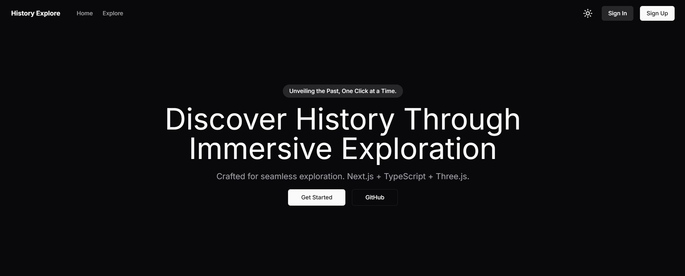

# History Explore 🚀

<!-- [Demo](https://history-explore.vercel.app/) -->

## Landing Page

<div align="center">

</div>

## Getting Started

1. Install dependencies

   ```bash
   npm install
   ```

2. Register an account on [Stack Auth](https://stack-auth.com), copy the keys from the dashboard, and paste them into the `.env.local` file. Then, enable "client team creation" on the team settings tab.

   If you want to learn more about Stack Auth or self-host it, check out the [Docs](https://docs.stack-auth.com) and [GitHub](https://github.com/stack-auth/stack).

3. Start the development server and go to [http://localhost:3000](http://localhost:3000)

   ```bash
   npm run dev
   ```

## Features & Tech Stack

- Next.js 14 app router
- TypeScript
- Tailwind & Shadcn UI
- Stack Auth
- Multi-tenancy (teams/orgs)
- Dark mode
